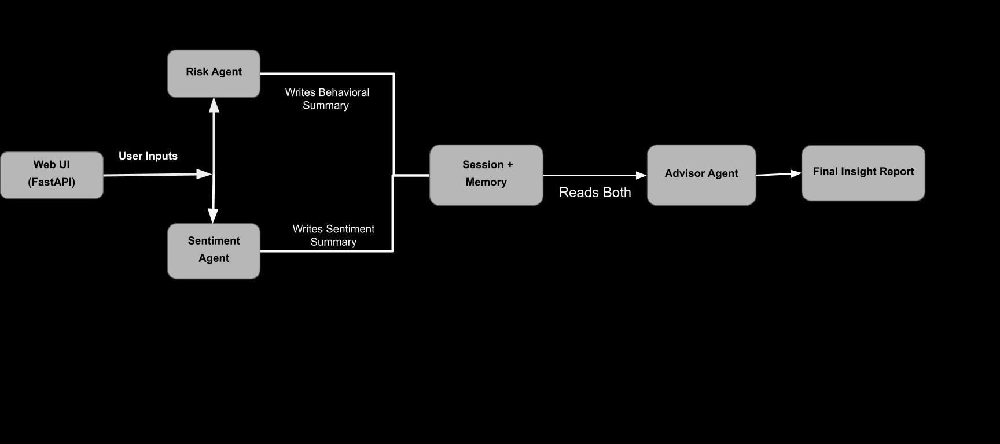
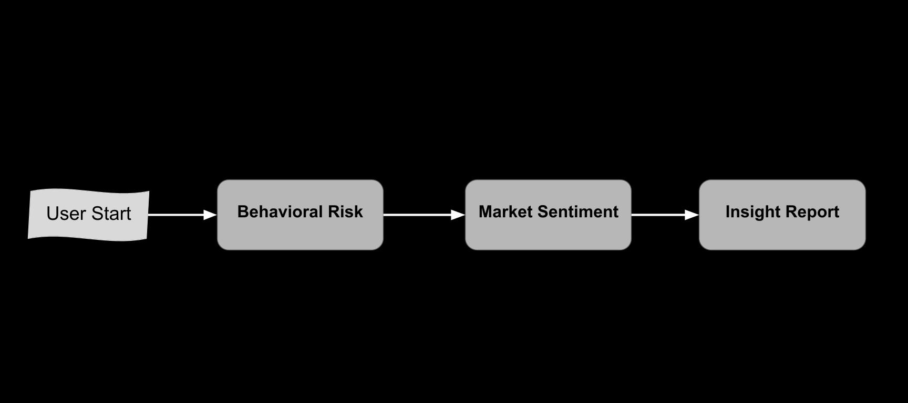
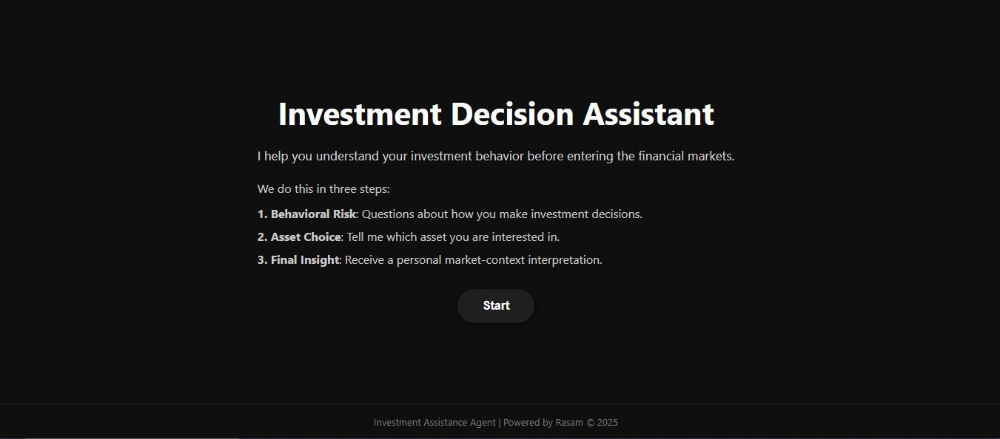

#  Investment Decision Assistant
### *A Multi-Agent System for Behavioral Risk Profiling, Market Sentiment Analysis, and Integrated Investment Insights*

---

##  Overview

The **Investment Decision Assistant** is a multi-agent AI system that guides users through three structured stages:

1. **Behavioral Risk Profiling**  
2. **Market Sentiment Analysis**  
3. **Final Integrated Insight**

The goal is to help individuals understand how their **behavioral tendencies** interact with the **current market environment** of their chosen asset.

This project is built for the **Kaggle × Google AI Agents Intensive (Capstone Project)** and demonstrates:

- Multi-agent architecture  
- Sessions & memory (InMemorySessionService + InMemoryMemoryService)
- Agent-to-agent communication  
- Tool use (Google Search)  
- Context injection + structured instructions    
- An interface (FastAPI + HTML/CSS)

> **Important:** The system provides **behavioral insights only**, NOT financial advice.

---

##  Problem Statement

Most retail investors struggle to understand:

- Their actual risk tendencies  
- How emotions shape their decisions  
- How market sentiment aligns (or conflicts) with their behavioral patterns  

This often leads to **inconsistent decisions** or **emotionally driven reactions**.

---

##  Solution Summary

The **Investment Decision Assistant** addresses this by combining:

### 1. Behavioral Risk Profiling  
A structured Q&A session that extracts:
- Stated risk style  
- Hidden instincts  
- Self-awareness level  
- Behavioral interpretations  

### 2. Market Sentiment Analysis  
The agent scans the latest reputable financial news and provides:
- Overall sentiment  
- 30-day price movement  
- Three key evidence points  
- Sources used  

### 3. Final Integrated Insight  
The system combines your behavioral profile with the current market situation of your chosen asset and generates a structured summary that includes:
- The user’s behavioral tendencies related to financial decision-making  
- The current market environment of the selected asset by the user 
- How these two factors interact, considering the user’s behavioral patterns and the condition of the asset  

This helps users reflect before entering the market.

---

##  System Architecture



A typical flow:

1. **Risk Agent** (interactive Q&A)
2. Saves final summary → memory
3. **Market Sentiment Agent** (Google Search tool)
4. Saves sentiment summary → memory
5. **Advisor Agent**
   - Loads risk summary (from memory)
   - Reads sentiment summary (from backend)
   - Produces the final integrated insight based on the two agents

---

##  Project Structure

```
project/
│
├── main.py
├── config.py
├── requirements.txt
├── README.md
├── .gitignore
│
├── agents/
│   ├── risk_agent.py
│   ├── sentiment_agent.py
│   └── advisor_agent.py
│
├── templates/
│   ├── welcome_page.html
│   ├── risk_page.html
│   ├── sentiment_page.html
│   └── advisor_page.html
│
├── images/
│   ├── welcome_screenshot.jpg
│   ├── risk_screenshot.jpg
│   ├── sentiment_screenshot.jpg
│   └── advisor_screenshot.jpg
```

---

##  Key Features Demonstrated (Course Requirements)

### **Multi-Agent System**
- 3 agents (Risk, Sentiment, Advisor)
- Sequential orchestration

### **Tools**
- `google_search` tool for real news analysis

### **Sessions & Memory** 
- Memory saved and loaded using ADK memory services

### **Context Engineering**
- Standardized system instructions  
- Structured formats for all agent outputs  

### **Deployment**
- Works as a FastAPI service  
- Can be deployed to Cloud Run, Render, or any VM

---

## How to Run Locally

### **1. Clone the repository**
```bash
git clone <your-repo-url>
cd investment-decision-assistant
```

### **2. Create environment**
```bash
conda create -n agentic python=3.10
conda activate agentic
```

### **3. Install dependencies**
```bash
pip install -r requirements.txt
```

### **4. Create `.env`**
```
GOOGLE_API_KEY=your_key_here
```

### **5. Start the app**
```bash
uvicorn main:app --reload
```

### **6. Open in browser**
```
http://127.0.0.1:8000/
```

---

##  User Experience Flow



### Step 1 — Behavioral Risk  
User answers between 5–15 behavioral questions  
→ Final structured summary is saved

### Step 2 — Market Sentiment  
User enters an asset (BTC, gold, AAPL, etc.)  
→ Agent runs Google Search  
→ Saves structured sentiment summary

### Step 3 — Final Insight  
Advisor agent produces:
- Behavioral tendencies  
- Market environment  
- Interaction between them  
- Short human-readable interpretation  

---

##  Screenshots

  
  
  


---

##  Video Demo

https://youtube.com/<your-demo-link>

---

##  Conclusion

The **Investment Decision Assistant** provides:

- A structured behavioral assessment  
- Evidence-based market sentiment analysis  
- A combined psychological insight  

It showcases the core ideas from the Google Agents Intensive course:  
**multi-agent reasoning, memory, tools, and context engineering**, all included in a clean, user-friendly web app.

---

##  Attribution
Built by **Ras Amirzadeh**  
For the **Kaggle × Google Agents Intensive Capstone (2025)**
